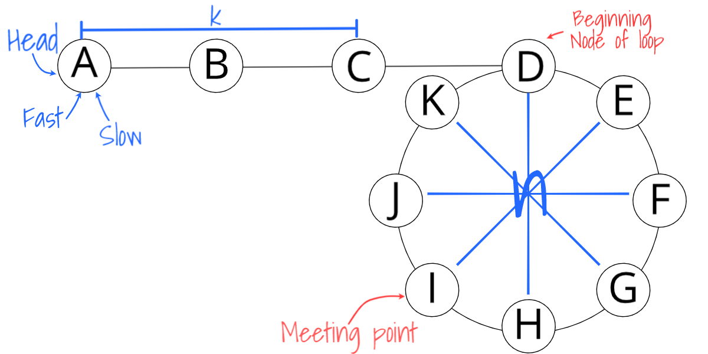

# Question
## Given a circular linked list, implement an algorithm which returns node at the beginning of the loop.
### Definition
Circular linked list: A (corrupt) linked list in which a node’s next pointer points to an earlier node, so as to make a loop in the linked list.
### Example
Input: A->B->C->D->E->C [the same C as earlier]  
Output: C

## Thinking
The method to solve circular linked list is very tricky. We are using two pointer technique. One slow pointer and one fast pointer(the speed of fast pointer is 2, and slow pointer is 1) iterate through the linked list. If there's a circle in the linked list, then the fast pointer will meet the slow pointer.(They will point to the same node.)  
The next question is, when fast pointer meets slow pointer, how can we find the beginning node of the loop?

Let's think about when fast pointer will meet slow pointer first:

Assuming that we have `k` nodes before the beginning node of the loop(Node `D` in the image), and there are `n` nodes(from `D` to `K`, `n = 8`) in the loop. The fast pointer `fast` and slow pointer `slow` point to Node `head` at the beginning. They move `k` steps to get the *beginning point of the loop*. Assuming that `fast` meets `slow` when `slow` moves `m` nodes. Then `fast` has moved `2m` nodes. The nodes which `fast` extra moved are all in the loop. It is the integer multiple of `n`, e.g.,
```
2m - m = pn 
    ||  (where p is positive integer)
    \/
  m = pn 
```

If `head` node is the first node, then the *meeting point* is `m + 1 = pn + 1`